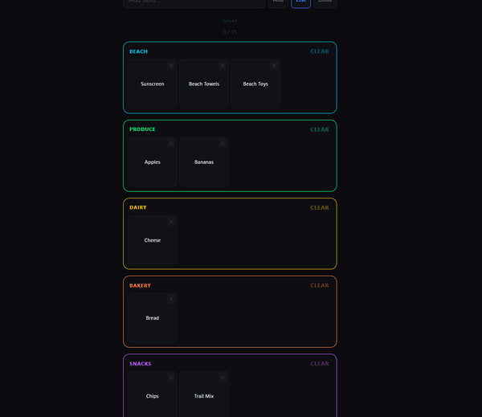
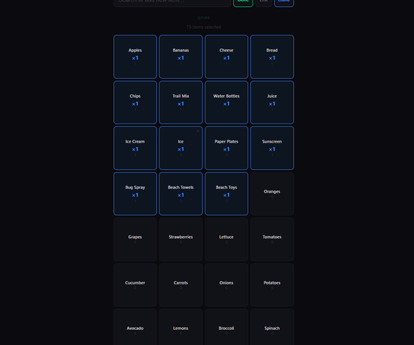

# Simple Shopping List

A family-friendly shopping list app with real-time sync across devices.

## Features

- **List mode** — tap square tiles to check items off, grouped by category with neon color borders
- **Build mode** — browse a catalog of common items sorted by frequency, tap to set quantities, then commit to your list
- **Real-time sync** — everyone sees changes instantly via WebSocket
- **Multiple lists** — duplicate, switch, and manage lists from the bottom sheet
- **PWA** — install on your phone for a native-like experience
- **Dark theme** — minimalist design with subtle neon accents

## Screenshots





## Quick Start

```bash
docker compose up -d
```

Open `http://localhost:3000` (or your machine's IP on the network).

## Manual Run

```bash
npm install
node server.js
```

## Tech

- Node.js + Express
- WebSocket (ws) for real-time sync
- Single-page frontend, no build step
- Data persisted to `./data/data.json`
